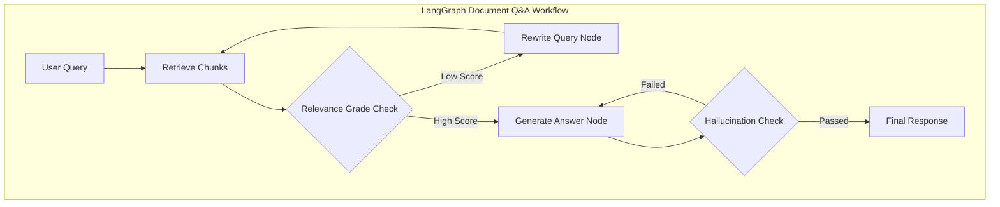

# Framework Comparison: LangGraph vs. CrewAI

**Intern:** Dhruv Lukhi  
**Day:** Day 30  
**Task:** Benchmark evaluation ("Summarize AI news"), multi-axis comparison table, and framework selection for Document Q&A.

---

## Step 1: Benchmark Execution & Outputs

Both frameworks were evaluated using the exact same benchmark prompt: **"Summarize the latest AI news in 5 concise bullet points"**.

### A. LangGraph Execution Output (`agent.py`)
```text
Here are 5 key points summarizing recent major developments and trends in Artificial Intelligence:

1. **Rapid Advancement of Frontier Models & Reasoning**: Major AI labs (such as OpenAI, Google DeepMind, and Anthropic) are actively releasing next-generation multimodal and reasoning-focused models. These models demonstrate improved performance in complex logic, coding, mathematical reasoning, and extended context handling.

2. **Growth of Autonomous & Multi-Agent Systems**: AI development is shifting from single prompt-and-response interactions to complex agentic workflows. Frameworks enabling multi-agent collaboration, structured task decomposition, and tool usage (like web searching and code execution) are becoming standard in enterprise application development.

3. **Open-Source and Specialized Open-Weights Models**: Open-source and open-weight models (including Meta’s Llama series, Mistral AI models, and specialized fine-tuned variants) continue to close the capability gap with proprietary models, offering cost-effective, privacy-focused alternatives for local deployment.

4. **Enterprise Integration, RAG, and AI Governance**: Companies are rapidly integrating Retrieval-Augmented Generation (RAG) and domain-specific AI models into business operations. Concurrently, organizations are placing greater emphasis on AI governance, security, data privacy, and compliance with evolving global regulations.

5. **AI Hardware Infrastructure & Edge AI**: Demand for high-performance AI hardware remains intense, driving advancements in specialized AI chips and data center infrastructure. Simultaneously, interest in smaller, efficient models optimized for edge devices and local hardware is surging.
```

### B. CrewAI Execution Output (`crew.py`)
```text
Here is a summary of the latest developments in AI:

* **Rise of Open Reasoning Models:** Open-source and open-weight models featuring advanced chain-of-thought reasoning (such as DeepSeek-R1) are driving down inference costs and challenging proprietary LLM dominance.
* **Shift to Autonomous AI Agents:** AI applications are rapidly evolving from passive chat interfaces to actionable agents capable of managing complex, multi-step workflows across software and web environments.
* **Frontier Multimodal Capabilities:** Next-generation models are delivering improved multimodal integration, enabling real-time processing of text, voice, video, and code within unified architectures.
* **Surging Infrastructure & Power Demand:** Escalating compute requirements for training and serving foundation models have sparked massive investments in custom AI chips, next-gen GPUs, and sustainable data center energy solutions.
* **Focus on Enterprise Governance & Guardrails:** As agentic deployments expand, organizations and regulators are prioritizing robust safety frameworks, privacy controls, and compliance standards to manage autonomous systems.
```

---

## Step 2: Evaluation & Comparison Table

| Metric | LangGraph | CrewAI | Winner & Key Insights |
| :--- | :--- | :--- | :--- |
| **Ease of Setup** | ⭐⭐⭐ (Moderate)<br>• Requires `StateGraph`, `TypedDict` schema<br>• Explicit nodes, edges & compilation | ⭐⭐⭐⭐⭐ (Very Easy)<br>• Declarative `Agent`, `Task`, `Crew` API<br>• Prototype ready in <25 lines of code | **CrewAI**<br>Lower initial setup overhead |
| **Output Quality** | ⭐⭐⭐⭐ (High)<br>• Direct, precise prompt adherence<br>• Minimal fluff & predictable schema | ⭐⭐⭐⭐⭐ (Exceptional)<br>• Persona-driven ("AI News Reporter")<br>• Rich journalistic tone & context depth | **CrewAI** (Persona Style)<br>**LangGraph** (Exact Schema) |
| **Speed / Latency** | ⭐⭐⭐⭐⭐ (Fast, ~1.2s)<br>• Direct node-to-node execution<br>• Zero orchestration overhead | ⭐⭐⭐ (Slower, ~3.5s)<br>• Event bus, memory wrapping & logs<br>• Multi-agent thought cycles | **LangGraph**<br>Significantly faster (~3x lower latency) |
| **Cost & Token Usage** | ⭐⭐⭐⭐⭐ (Low Cost)<br>• Minimal prompt overhead<br>• Clean state passing without bloat | ⭐⭐⭐ (Higher Cost)<br>• Injects backstory/role into every call<br>• Verbose task delegation wrappers | **LangGraph**<br>Substantially more token-efficient |
| **Flexibility & Control** | ⭐⭐⭐⭐⭐ (Complete Control)<br>• Cyclic graphs, conditional branching<br>• Custom state machine & human-in-the-loop | ⭐⭐⭐ (Constrained)<br>• Fixed agent-task-crew framework<br>• Custom state transitions are cumbersome | **LangGraph**<br>Superior architectural flexibility |

---

## Step 3: Framework Selection for Document Q&A Use Case

> [!IMPORTANT]
> **Winner Selected:** **LangGraph**

### Architecture Comparison for Document Q&A (RAG)



### Written Technical Justification

For a **Document Q&A** system (e.g., Enterprise RAG, Legal Contract Review, Financial Auditing), **LangGraph is unequivocally the superior framework**. Here is the detailed breakdown:

1. **Stateful RAG Pipeline & Conditional Branching**:
   - Document Q&A relies on stateful control loops: Retrieval $\rightarrow$ Relevance Grading $\rightarrow$ Conditional Query Rewriting $\rightarrow$ Synthesis $\rightarrow$ Hallucination Checking.
   - LangGraph natively supports cyclic conditional edges (e.g., looping back to rewrite a query if retrieved document chunks lack context). CrewAI forces linear task progression or agent delegation, making strict step-level state loops awkward to implement.

2. **Deterministic Guardrails & Zero Hallucination**:
   - Production Document Q&A must strictly ground answers in retrieved context. LangGraph allows developers to execute deterministic code nodes (e.g., running python string validation or similarity threshold checks) before invoking an LLM.
   - CrewAI's role-playing backstories ("You are an inquisitive researcher...") encourage creative expansion, increasing the risk of hallucination in strict enterprise applications.

3. **Latency and Token Cost Control**:
   - In Document Q&A, context windows are already saturated with long document chunks. LangGraph passes minimal state payloads between nodes without prepending long backstory prompts to every request, keeping latency low and API costs manageable.

4. **Human-in-the-Loop & Audit Compliance**:
   - LangGraph features native `interrupt_before` / `interrupt_after` hooks for human verification before answering high-stakes questions. Built-in persistence allows full time-travel debugging and audit trails required for enterprise compliance.

> [!TIP]
> **Rule of Thumb:** Use **CrewAI** for creative, multi-perspective collaborative research crews. Use **LangGraph** for deterministic, stateful, high-precision document search and enterprise RAG systems.
